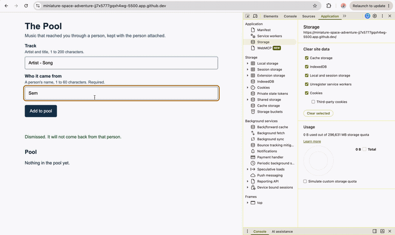

# The Pool


## What

Two interviews found the same thing from opposite directions: the music people trust most comes from other people, and none of it has anywhere to live. A track played in a friend's Spotify Jam is gone when the session ends. This repository holds the specification for a system that fixes that, plus a working slice: a pool where nothing enters without the name of the person it came from. **As of HW4 the entries no longer live in the browser — they live in a Cloudflare D1 database behind a Worker I deployed, so the pool survives a cleared cache and appears in any browser.** Background: [PROJECT.md](context/PROJECT.md) for the problem and its framing, [FEATURES.md](context/FEATURES.md) for the specification and verification, [TOOLS.md](context/TOOLS.md) for what crosses to whom. The HW3 version, which stored everything locally, is at [mgt3745-hw3](https://github.com/semajjohnson/mgt3745-hw3).

## See It Work



This shows persistence across clients: the entry was created in one browser and appeared in a second, which is only possible because the data left the machine. It is the evidence for the A5 persistence row in [Verification](context/FEATURES.md#verification).

## How to Run

**Deployed:** the Worker is live at [https://mgt3745-hw4.semajjohnson.workers.dev](https://mgt3745-hw4.semajjohnson.workers.dev). Open [`/entries`](https://mgt3745-hw4.semajjohnson.workers.dev/entries) to see the raw JSON the page consumes.

To run the page:

1. Open this repository in a Codespace: **Code → Codespaces → Create codespace on main**.
2. Right-click `index.html` and choose **Open with Live Server**, or run `python3 -m http.server 5500` in the terminal.
3. Open port 5500 from the **Ports** tab.
4. Add a track and the name of the person it came from. The entry is stored on Cloudflare, not in your browser.

To see the failed-response path, add `?apiDown` to the page URL. The fetch is pointed at an endpoint the Worker does not answer, and the page reports the failure instead of throwing.

To run the Worker locally instead of using the deployed one:

```bash
npm install
npx wrangler d1 execute mgt3745-entries --local --file=schema.sql
npm run dev        # serves the Worker on port 8787 with a local D1 emulator
```

Then change `apiBase` at the top of `app.js` to `http://localhost:8787`. Deploying your own copy needs `npx wrangler login`, `npx wrangler d1 create`, the database id pasted into `wrangler.toml`, the schema run with `--remote`, and `npx wrangler deploy`.

## Status

| Area | State | Why |
|------|-------|-----|
| Add an item with a source (A5) | Works | [Verification](context/FEATURES.md#verification) |
| Reject an item with no source (A5, A8) | Works | Server returns 400 naming the field |
| Entries survive a cleared cache and a second browser | Works | Confirmed in a second browser |
| Two people, one track (A6) | Works | Merged for display from two rows |
| Dismissal blocks re-adding (A7) | Works | Was CANNOT TEST YET in HW3 |
| Failed response handled on the page | Works | `?apiDown` shows a message, throws nothing |
| Server 500 path | Cannot test yet | I cannot trigger an unexpected exception on a deployed Worker without shipping broken code |
| Two clients writing at once | Deferred | Single-user by design; see [ADR-002](context/ARCHITECTURE.md) |
| Automatic capture (A1–A4) | Deferred | No platform exposes shared-session events; see [ADR-001](context/ARCHITECTURE.md) |

## Links

Read in this order:

0. [`SCAFFOLD_MANIFEST.md`](SCAFFOLD_MANIFEST.md): what carries over, plus a submission checklist
1. [`context/PROJECT.md`](context/PROJECT.md): the problem and its framing
2. [`context/USERS.md`](context/USERS.md): who this is for
3. [`context/FEATURES.md`](context/FEATURES.md): what it must do, and verification results
4. [`context/ARCHITECTURE.md`](context/ARCHITECTURE.md): the gate, ADR-001, and ADR-002
5. [`context/STANDARDS.md`](context/STANDARDS.md): the rules this code follows
6. [`context/CLAUDE.md`](context/CLAUDE.md): the same rules, for agents
7. [`context/TOOLS.md`](context/TOOLS.md): every external service and what crosses to it
8. [`context/STYLE.md`](context/STYLE.md): design tokens and what they refuse

[SKILLS.md](context/SKILLS.md), [EVALS.md](context/EVALS.md), and [AGENTS.md](context/AGENTS.md) remain previews until Modules 5 and 6.

## AI Use

**Tool and task delegated:** Claude drafted `worker.js`, the rewritten `app.js`, `schema.sql`, and prose for `ARCHITECTURE.md` and `TOOLS.md`. Copilot is enabled in my Codespace but I did not accept a suggestion from it this week. The gate weights, the scores, the scope decisions, and every crossing statement are mine.

**Why:** the Worker is small and the assignment's point is reading it rather than producing it, so I had it drafted against the rules already in `context/CLAUDE.md` and spent my time testing behavior instead of typing syntax I do not yet know.

**How it was checked:** I ran every acceptance path against the deployed URL — adding an entry, submitting with the source empty, the same track from the same person, the same track from a second person, dismissing and then re-adding, and `?apiDown` — and recorded each in the [Verification table](context/FEATURES.md#verification). I confirmed persistence by opening the page in a second browser. I checked that every user value reaches SQL through `bind()` and that no string-concatenated SQL, `innerHTML`, or `console.log` appears in `worker.js` or `app.js`.

**What I could not fully verify:** the CORS header block. I read it and I can describe what it is supposed to do — tell the browser my page is allowed to call the Worker — but I did not verify it by experiment, and I could not have written it myself. The honest state is that I accepted it because the page worked with it there, which is weaker evidence than removing it and watching the failure would have been. The same applies to the `try`/`catch` wrapper that converts an exception into a 500: I have never seen it fire, which is why the server-500 row in my verification table is CANNOT TEST YET rather than PASS.

**What I did about it:** I recorded both as unverified rather than claiming them as tested, and the 500 row names the limitation and the next step. Removing the CORS block, deploying, watching it fail, and restoring it is the experiment I should run before HW5.

**Instruction discovery and compliance:** not run. No AI tool executed inside this repository, so no adapter discovery could be observed. The standards review was manual, as described above.

**Actual hours on this assignment:** roughly 6.