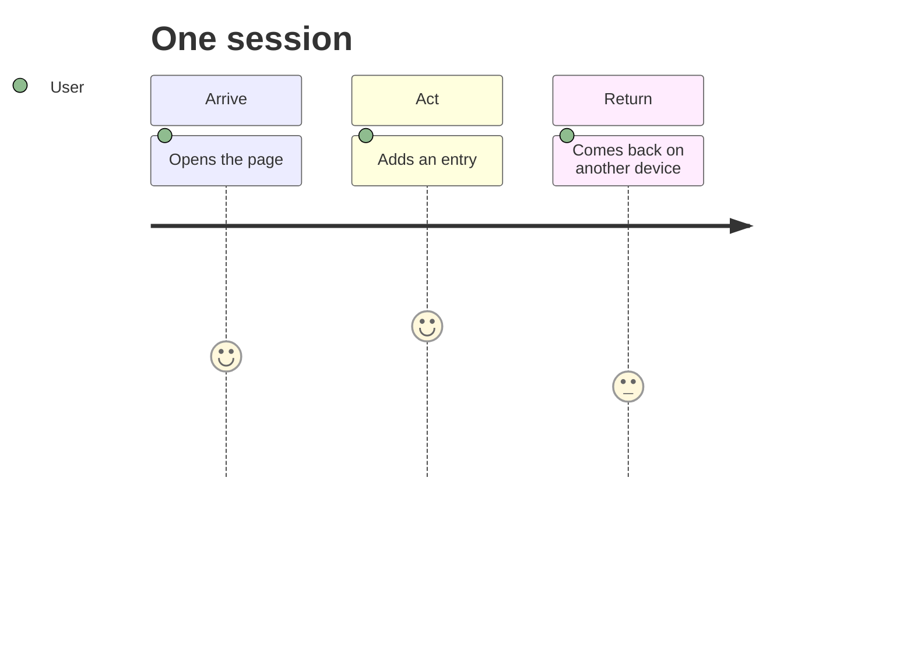

# USERS.md

Copy in from HW2, with revisions from feedback.

## Primary user

*Name, role, goal, friction. Where they are when they use this.*

## Secondary user

*...*

## Journey

```mermaid
journey
  title One session
  section Arrive
    Opens the page: 4: User
  section Act
    Adds an entry: 5: User
  section Return
    Comes back on another device: 3: User
```
